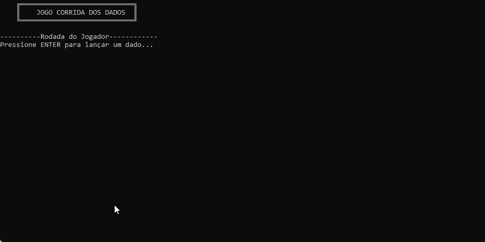

# 🧮 Jogo Corrida de Dados Console

## 🎥 Demonstração

<p align="center">
  
</p>

---

## 📌 Introdução

Projeto desenvolvido durante a **Academia do Programador 2026** com o objetivo de revisar conceitos fundamentais de lógica de programação utilizando C# em aplicações Console.

---

## 🚀 Funcionalidades

* Ao pressionar Enter, um número entre 1 e 6 é escolhido de forma aleatória, simulando um jogo de dados.
* O computador e o jogador alternam jogadas em turnos.
* Alguns eventos, como avanços ou retrocessos, foram configurados em determinados pontos.

---

## 🛠 Tecnologias Utilizadas

* C#
* .NET

---

## ▶️ Como executar o projeto

```bash
git clone https://github.com/Vanderluizsj/AcademiaDoProgramadorBackEnd.git
cd CorridaDeDados.ConsoleApp
dotnet run
```

---

## 🎯 Objetivo

* Praticar lógica de programação
* Trabalhar com estruturas condicionais e de repetição
* Organização em classes e métodos

---

## 👨‍💻 Autor

**Vanderluiz Oliveira**
