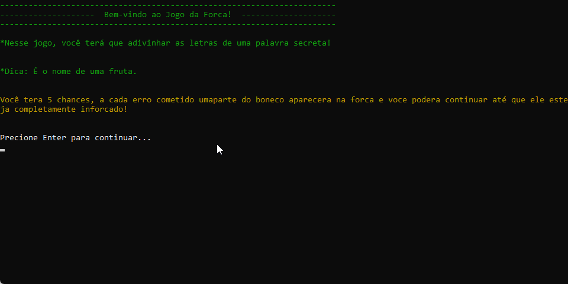

# 🧮 Jogo da Forca Console

## 🎥 Demonstração

<p align="center">
  
</p>

---

## 📌 Introdução

Projeto desenvolvido durante a **Academia do Programador 2026** com o objetivo de revisar conceitos fundamentais de lógica de programação utilizando C# em aplicações Console.

---

## 🚀 Funcionalidades

* O sistema escolhe o nome de uma fruta, em uma lista pré determinada, de forma aleatória
* O jogador deve digitar as letras, uma a uma, até que a palavra esteja completa
* A cada erro uma parte do boneco aparece "enforcado", sendo a corda a primeira parte a aparecer na força após o primeiro erro

---

## 🛠 Tecnologias Utilizadas

* C#
* .NET

---

## ▶️ Como executar o projeto

```bash
git clone https://github.com/Vanderluizsj/AcademiaDoProgramadorBackEnd.git
cd JogoDaForca.ConsoleApp
dotnet run
```

---

## 🎯 Objetivo

* Praticar lógica de programação
* Trabalhar com estruturas condicionais e de repetição
* Organização em classes e métodos

---

## 👨‍💻 Autor

**Vanderluiz Oliveira**
