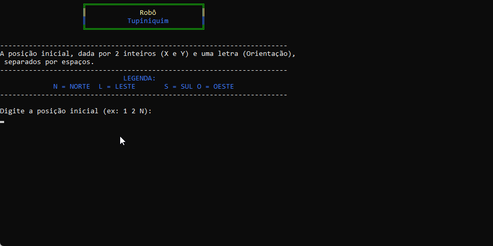

# Jogo Robô Tupiniquim Console

## 🎥 Demonstração

<p align="center">
  
</p>

---

## 📌 Introdução

Projeto desenvolvido durante a **Academia do Programador 2026** com o objetivo de revisar conceitos fundamentais de lógica de programação utilizando C# em aplicações Console.

---

### Especificação  
Neste projeto, desenvolvemos o jogo do Robô Tupiniquim, em console, utilizando C#.

O objetivo é permitir que um jogador passe uma posição inicial e comandos de direção e movimento para que o robo os execute.

### Sobre o Sistema

- Jogador escolhe a posição inicial do Robo
- Jogador escolhe os comandos de direção e movimento
- Resultado: o sistema mostra a movimentação do Robo e a posição final

## Como utilizar

1. Clone o repositório ou baixe o código fonte.
2. Abra o terminal ou o prompt de comando e navegue até a pasta raiz
3. Utilize o comando abaixo para restaurar as dependências do projeto.

   ```bash
   dotnet restore
   ```

4. Para executar o projeto compilando em tempo real

   ```bash
   dotnet run --project RoboTupiniquim.ConsoleApp
   ```

## Requisitos

- .NET 10.0 SDK
---

## 🎯 Objetivo

* Praticar lógica de programação
* Trabalhar com estruturas condicionais e de repetição
* Organização em classes e métodos

---

## 👨‍💻 Autor

**Vanderluiz Oliveira**
